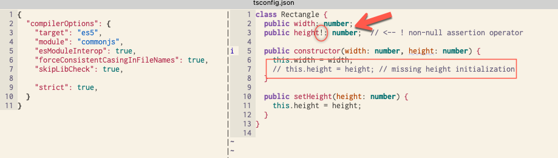
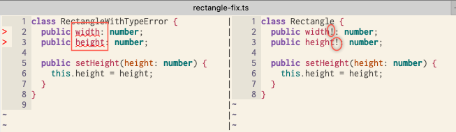
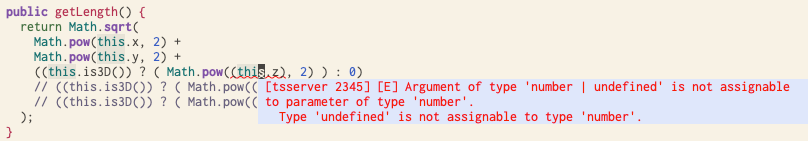

# Non-null assertion operator

You can use the **non-null assertion operator** [reference](https://stackoverflow.com/questions/42273853/in-typescript-what-is-the-exclamation-mark-bang-operator-when-dereferenci) to tell to temporarily relax the "not null" constraint that it might otherwise demand. 




## Class without constructor

It is very common to encounter above type error when we define a class without a constructor, so we use non-null assertion operator




## Another usage of non-null assertion operator


```typescript
class Vector {

  public constructor(
    public x: number,
    public y: number,
    public z?: number   // <--- optional
  ) {}

  public is3D() {
    return this.z !== undefined;
  }

  public is2D() {
    return this.z === undefined;
  }

  public getLength() {
    return Math.sqrt(
      Math.pow(this.x, 2) +
      Math.pow(this.y, 2) +
      // ((this.is3D()) ? ( Math.pow((this.z), 2) ) : 0)
      // ((this.is3D()) ? ( Math.pow((this.z as number), 2) ) : 0)
      ((this.is3D()) ? ( Math.pow((this.z!), 2) ) : 0)  // <------ (see note)
    );
  }

}
```

The above example is from p123a--optional-members.


Note:



In the above we assert that this.z to be number because type checker is unable to conclude without running `this.is3D()`. So we have to assert that `this.z` to `number type`:

```typescript
((this.is3D()) ? ( Math.pow((this.z as number), 2) ) : 0)
```

In the case like this we can use non-null assertion operator:

```typescript
((this.is3D()) ? ( Math.pow((this.z!), 2) ) : 0)
```

From: 

> As a motivating example: using the new ES Map type with code like `dict.has(key) ? dict.get(key) : 'default';` the TS compiler can't infer that the `get` call never returns null/undefined. `dict.has(key) ? dict.get(key)! : 'default';` narrows the type correctly. 
>
>  [May 30 2018 at 22:58](https://stackoverflow.com/questions/42273853/in-typescript-what-is-the-exclamation-mark-bang-operator-when-dereferenci#comment88238625_42274019)


and https://www.typescriptlang.org/docs/handbook/release-notes/typescript-2-0.html#non-null-assertion-operator


