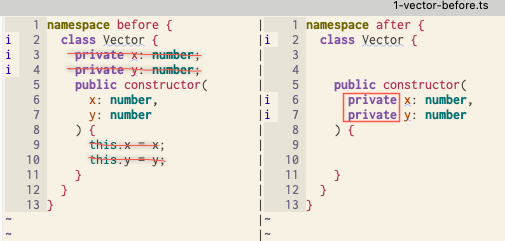

# Parameter properties help reduce verbosity

We only need to **remove** the property declarations and its initialization, and **add** access modifiers **to the arguments** of the constructor of the class.