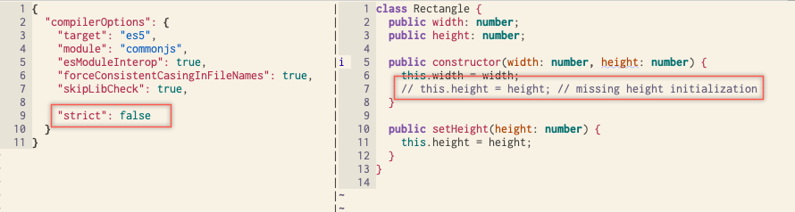
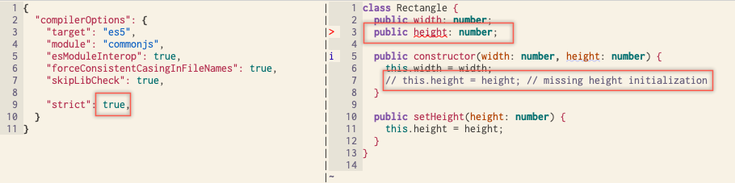
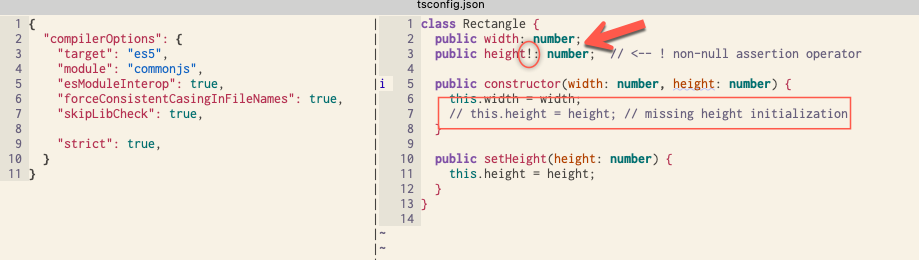
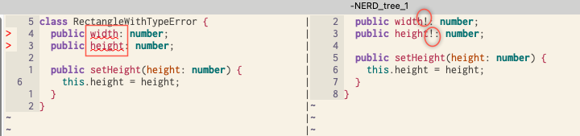

# Strict property initialization

p111

When `strict` is `false`  you can skip initializing al property:

However, if you set  `strict` to  `true` , missing initialization is a type error.

## Non-null assertion operator

You can use the **non-null assertion operator** [reference](https://stackoverflow.com/questions/42273853/in-typescript-what-is-the-exclamation-mark-bang-operator-when-dereferenci) to tell to temporarily relax the "not null" constraint that it might otherwise demand. 

## Class without constructor

It is very common to encounter above type error when we define a class without a constructor, so we use non-null assertion operator

