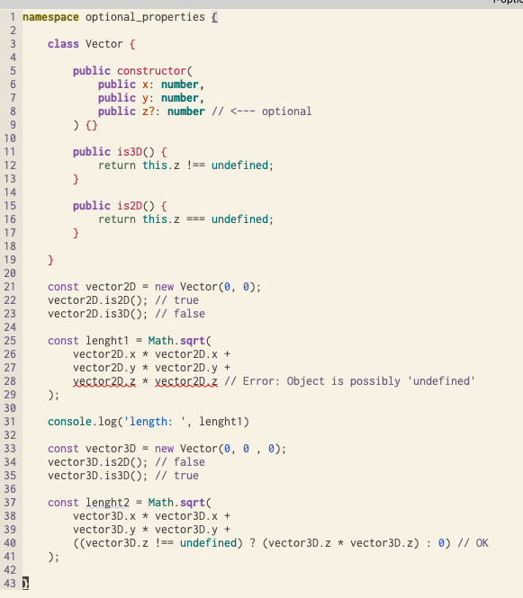

# Optional members


### code with error:




### Improved code:

```typescript
namespace optional_properties_improved {

    class Vector {

        public constructor(
            public x: number,
            public y: number,
            public z?: number  // <--- optional
        ) {}

        public is3D() {
            return this.z !== undefined;
        }

        public is2D() {
            return this.z === undefined;
        }

        public getLength() {
          return Math.sqrt(
              Math.pow(this.x, 2) +
              Math.pow(this.y, 2) +
              ((this.is3D()) ? ( Math.pow((this.z as number), 2) ) : 0)
          );
        }

    }

    const vector2D = new Vector(1, 1);
    console.log('vector2D is2D: ', vector2D.is2D())
    console.log('vector2D is3D: ', vector2D.is3D())
    console.log('vector2D length: ', vector2D.getLength())

    const vector3D = new Vector(0, 1, 1);
    console.log('vector3D is2D: ', vector3D.is2D())
    console.log('vector3D is3D: ', vector3D.is3D())
    console.log('vector3D length: ', vector3D.getLength())

}
```


Results

```
$ ts-node 2-optional-props.ts
vector2D is2D:  true
vector2D is3D:  false
vector2D length:  1.4142135623730951
vector3D is2D:  false
vector3D is3D:  true
vector3D length:  1.4142135623730951
```

